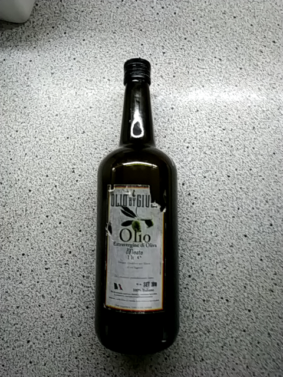
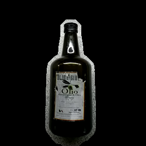
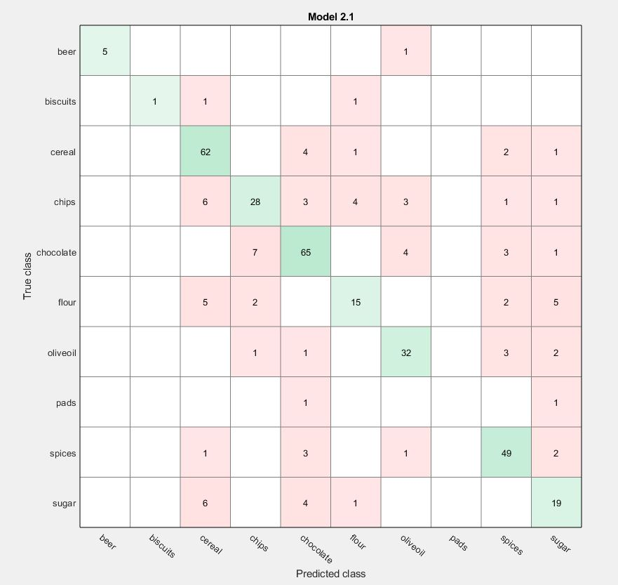
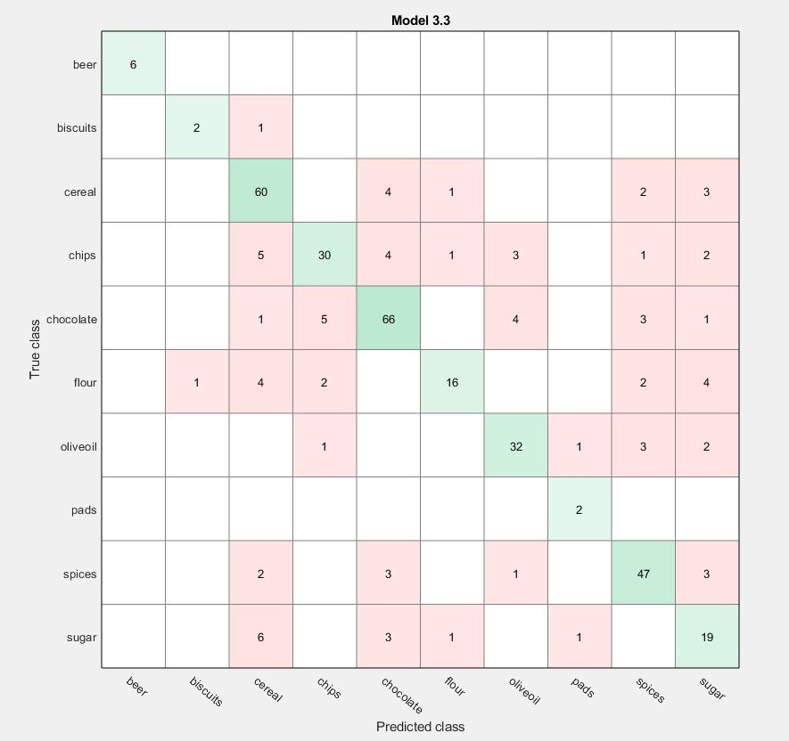

*La presentazione verrà eseguita con reveal.js motivo per cui viene allegato il testo della presentazione in formato markdown*

# Presentazione

Federico Lodovici 816040
Luca Di Gennaro 820612

## Intro

### Scope del progetto

Il progetto consiste nel riconoscimento di 10 differenti classi di oggetti,
i quali possono essere posti su superfici qualsiasi, sia uniformi che
texturizzate.
Le immagini possono contenere svariati oggetti che devono però appartenere
alla stessa classe.
Le classi di oggetti che abbiamo deciso di riconoscere sono:
* Assorbenti
* Birra
* Biscotti
* Cereali
* Cioccolato
* Farina
* Olio d'oliva
* Patatine
* Spezie
* Zucchero

E' possibile settare una soglia che stabilisce, nel caso in cui si tenti di classificare un oggetto non 
appartente ad alcuna classe, se l'oggetto è riconosciuto o meno. In ogni caso è possibile 
ottenere come risultato un array di score che rappresenta quanto il classificatore è sicuro
che l'oggetto appartenga a una delle classi sopracitate.

### Pipeline

### Vantaggi

1. Permette di eliminare la problematica dello sfondo
2. La CNN permette un' estrazione di feautures più robuste e consistenti
    rispetto agli altri metodi [1][1]

[1]: https://arxiv.org/abs/1403.6382

### Svantaggi e difficoltà

1. Abbiamo varie somiglianze tra alcune classi, per cui è possibile che alcuni
    oggetti vengano classificati in modo erroneo.
2. Sono richieste molte immagini nel dataset di training.
3. L'operazione di training è molto dispendiosa a livello computazionale.

## Come funziona

### Raccolta Dataset

Abbiamo raccolto immagini con 3 diverse modalità:

1. Abbiamo utilizzato una piccola webapp che ci ha permesso di raccogliere
    immagini fotografando i prodotti in diversi contesti.
2. Abbiamo utilizzato parte del dataset grocery market dell' università di
    friburgo.
3. Abbiamo utilizzato qualche immagine di sample dal web per arricchire
    ulteriormente il dataset.

### Preprocessing

  La fase di preprocessing permette di segmentare ragionevolmente l'area degli
  oggetti presenti nell'immagine, in modo da ridurre il più possibile le
  informazioni spurie dello sfondo e facilitare l'estrazione di feature rilevanti da 
  parte della CNN.
  La politica di segmentazione prevede la presenza di eventuali porzioni 
  di sfondo perchè è preferibile avere un piccolo eccesso di sfondo che perdere 
  potenziali parti degli oggetti (in seguito a erosioni) da cui si possono estrarre 
  feature rilevanti mediante CNN.

  La fase di preprocessing è divisa in diverse sottofasi:
  1. Scaling dell'immagine
      * Permette di passare alla CNN immagini della stessa dimensione e di 
	applicare gli stessi operatori morfologici
  2. Smoothing gaussiano
      * Permette di ridurre il rumore nell'immagine per evidenziare i contorni
	e facilitare il calcolo degli edge rilevanti riducendo quelli spuri
  3. Calcolo degli edge sui 3 canali RGB
      * Sfrutta l'algoritmo di Canny per rilevare gli edge
      sui tre canali colore per ottenere contorni più solidi rispetto a quelli 
      dell'immagine a livelli di grigio
  4. Unione dei 3 edge calcolati
      * Unisco gli edge appena trovati sui canali colore in una unica edge image
  5. Dilatazione/chiusura degli edge e fill dei buchi
      * Tramite la dilatazione collego i contorni che potrebbero non essere 
	ancora completi ed eseguo un fill dei contorni chiusi
  6. Apertura degli edge per rimuovere eventuali bordi spuri
      * Una volta riempite le aree dei contorni eseguo una open (fill+dilate)
	per rimuovere bordi e forme spurie create dalle fasi precedenti

### Estrazione features (CNN)

L' Estrazione di features avviene utilizzando una Convolutional Neural Network.

Abbiamo utilizzato due differenti modelli di rete  con la tecnica del
*transfer learning*:
* AlexNet
* GoogleNet

Per entrambe le reti sono stati eliminati gli ultimi layer della rete
pre-addestrata e sostituiti con dei nuovi layer in modo tale da ridurre
l' output da 1000 a 10 classi, per meglio adattarsi al nostro dataset.

Una volta riaddestrata la rete a cui sono stati aggiunti i nuovi layer le
features vengono estratte dall' ultimo layer prima dei livelli di classificazione.

### Classificazione

Si è utilizzato un classificatore del tipo Ensemble KNN.

Al classificatore vengono dati in input le features estratte dall' immagine con la CNN.

Si è utilizzata la tecnica della combinazione di più classificatori KNN per migliorare l'accuratezza.

E' stato scelto di utilizzare KNN in quanto permette una classificazione robusta e in tempi rapidi.

### Sample

| Input                                          | Preprocessing                                            | Output                                        |
| ---------------------------------------------- | -------------------------------------------------------- | --------------------------------------------- |
|  |  |  |

## Prestazioni e comparison

### Scelte preprocessing
Ecco alcune delle varie strategie contemplate per il preprocessing: 

***Utilizzo di altri spazi colore***

Sono stati testati gli spazi HSV e YCbCr 
* Per l'HSV è stata testata la tinta per individuare meglio zone di colore diverso
	e segmentare conseguentemente
* Per l'YCbCr sono stati testati i canali di crominanza per lo stesso motivo

In conclusione, è stato adottato lo spazio RGB in quanto sono stati ottenuti risultati più robusti e contorni
più delineati calcolando gli edge per ogni colore ed unendoli.

***Utilizzo di altri algoritmi di edge detection***

Sono stati testati diversi metodi di edge detection fra cui Sobel, Prewitt, LoG (Laplacian of Gaussian) 
e Canny. 

I primi due metodi tendevano a non trovare alcuni edges in corrispondenza di colori simili vicini fra loro,
impossibilitando di fatto la close e la fill degli edges. Fra il LoG e Canny (quest'ultimo combinato con 
lo smoothing gaussiano) è stato scelto il Canny perchè ha avuto performance di edge detection migliori.

***Scelta degli operatori morfologici***

Sono state testate diverse dimensioni e forme di elementi strutturanti, fra cui 
* linee orientate orizzontalmente,verticalmente e obliquamente
* quadrati
* dischi

I dischi sono stati gli elementi strutturanti che hanno unito i contorni meglio secondo la politica
di segmentazione accennata in precedenza. 

### Prestazioni vari modelli di rete

#### Googlenet vs Alexnet

E' stata monitorata in particolare la funzione di loss durante il training delle reti.

###### Alexnet:

###### Googlenet:

Non si notano grandi differenze nella loss delle due reti.

### Prestazioni vari classificatori

Le prestazioni dei vari classificatori sono state monitorate utilizzando una confusion matrix, nella tabella successiva si riportano i vari classificatori con l' accuracy e la rispettiva confusion matrix

| SVM 77%                                                    | Tree 65%                                                                |
| ---------------------------------------------------------- | ----------------------------------------------------------------------- |
|          |                |
| **KNN 76%**                                                | **Ensemble KNN 78%**                                                    |
|  |  |

SVM, Ensemble KNN e KNN hanno mostrato accuratezza simile, Tree invece ha mostrato un'accuratezza molto inferiore.

## Conclusione

Abbiamo deciso di usare Alexnet in quanto più semplice e con tempi di training inferiori e un' insieme di classificatori KNN in quanto ci garantivano la miglior accuratezza nel riconoscimento pur essendo classificatori molto semplici e che richiedono poche risorse.

## Divisione del lavoro
Le principali macro-aree su cui abbiamo lavorato sono:
* Preprocessing e generazione del contrasted set 
    * Principale contribuente : Di Gennaro Luca
* Training della CNN ed estrazione delle feature
    * Principale contribuente : Lodovici Federico
* Riconoscimento di una immagine :
    * Entrambi abbiamo contribuito in questo campo
    
Il nostro obiettivo era mantenere il carico di lavoro il più possibile equivalente ed entrambi
abbiamo testato e perfezionato il lavoro l'uno dell'altro; pertanto è difficile stabilire con
certezza una percentuale di chi ha lavorato di più e chi di meno.

Siamo certi che, se si voglia stimare una percentuale, ognuno ha svolto circa il 50% 
del lavoro necessario per implementare il progetto.

# Demo
